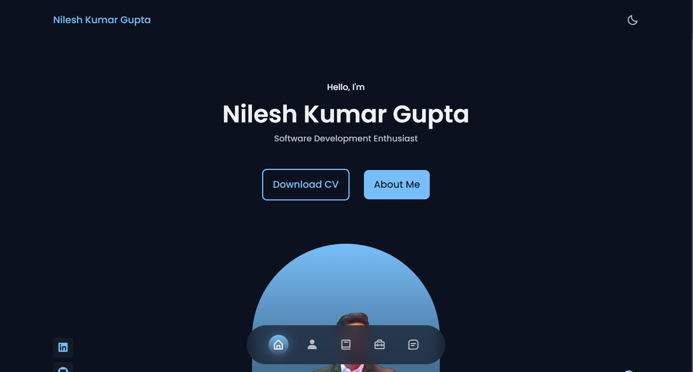
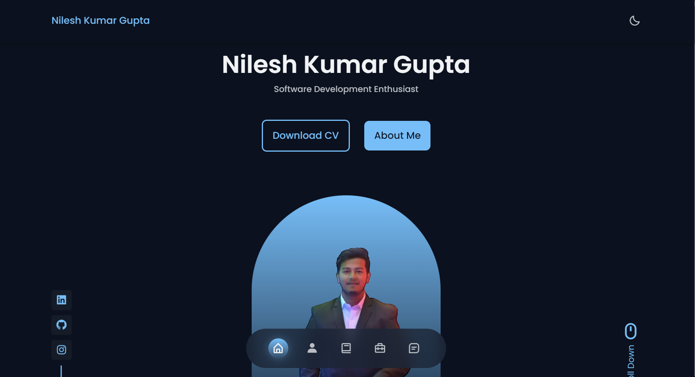

# __Personal Portfolio__

 - Welcome to my __personal portfolio website!__ This is a place for me to showcase my work and share my experiences with the world. Here you will find a collection of __projects__ I have completed, __resume__, and __contact information__. Feel free to explore around and learn more about me. 

- You can find a detailed overview of my work experience and education on my resume page. This page also contains a list of skills and technical proficiencies I have acquired over the years.

- On the projects page, you will find a list of projects I have completed. This includes both professional and personal projects. Each project has a detailed description and links to the respective code and/or website.

- Lastly, you can contact me on the contact page. You can find my contact information, including my email address, social media accounts, and phone number.

- __Thank you__ for visiting my __personal portfolio website__. I hope you find my work and experiences interesting. Feel free to reach out if you have any questions or would like to learn more about me.

# __Screenshots__

- ## __Home page__





- ## __About page__

.png)

.png)


- ## __Skills__

.png)


- ## __Services__

.png)

.png)

- ## __Recent Projects__

.png)

.png)

.png)

.png)

- ## __Testimonial__

.png)

- ## __Contact me__

.png)


.png)

***
## __Connect with me__
<br>
<a href="https://linkedin.com/in/nileshkumargupta05/" target="blank"></a>
<a href="https://stackoverflow.com/users/20517271" target="blank"></a>
<a href="https://instagram.com/_nilesh2202" target="blank"></a>
<a href="https://www.hackerrank.com/guptanilesh417" target="blank"></a>
</p><br>


- [](mailto:guptanilesh417@gmail.com)


```python
print("Hello I am Nilesh🙋‍♂️.")
```
```python
print("Nice to meet you. see you soon")
```
```python
print("Show some ❤️ to my Repositories.")
```


- __[Click to see __Website working__](# "website link")__
    

